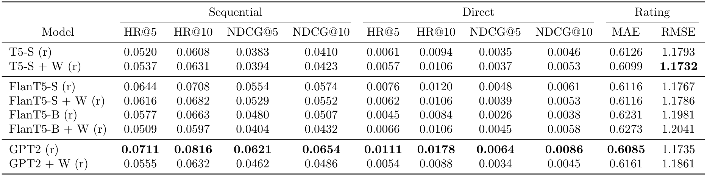
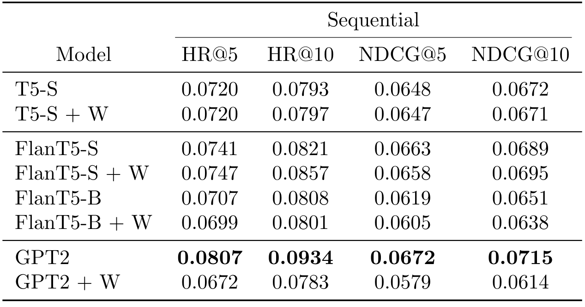

# Other Experiments

This directory contains all the `.yml` config files and results of additional experiment runs by varying the `train_task_selection_strategy`
hyperparameter and the training tasks provided by *AnonLLM*.
All the following results make use of the new set of prompts defined that can be found [here](https://doubleblind-anon.github.io/AnonLLM/yaml_usage/available_implementations/available_tasks/).

Each result directory contains a table storing metrics results for each task in both `.csv` and `.tex` format, generated with *AnonLLM*.

All runs have been tracked with **WandB**. The full workspace is available by clicking the following image:

  

## Experiment 'random'

These are the results of T5-S, FlanT5-S, FlanT5-B, GPT2, with (***+W***) and without personalization, when trained and evaluated on the *Sequential*, *Direct* and *Rating Prediction* tasks
with `train task selection strategy: random`. The evaluation is carried out on all prompts, already *seen* by the model during the fine-tuning phase,
and in the following table there are reported the best results for each metric achieved by any prompt of the specific task (*best-seen*).

    

### T5 runs

- **T5-S (r)**: [[.yml config](exp_random/exp_random_t5_s.yml)][[Results directory](exp_random/metrics_results/exp_random_t5_s)][[Visualize in WandB](../redirect_wandb_links.txt)]
- **T5-S + W (r)**: [[.yml config](exp_random/exp_random_t5_s+w.yml)][[Results directory](exp_random/metrics_results/exp_random_t5_s+w)][[Visualize in WandB](../redirect_wandb_links.txt)]

### Flan T5 Runs

- **FlanT5-S (r)**: [[.yml config](exp_random/exp_random_flan_t5_s.yml)][[Results directory](exp_random/metrics_results/exp_random_flan_t5_s)][[Visualize in WandB](../redirect_wandb_links.txt)]
- **FlanT5-S + W (r)**: [[.yml config](exp_random/exp_random_flan_t5_s+w.yml)][[Results directory](exp_random/metrics_results/exp_random_flan_t5_s+w)][[Visualize in WandB](../redirect_wandb_links.txt)]
- **FlanT5-B (r)**: [[.yml config](exp_random/exp_random_flan_t5_b.yml)][[Results directory](exp_random/metrics_results/exp_random_flan_t5_b)][[Visualize in WandB](../redirect_wandb_links.txt)]
- **FlanT5-B + W (r)**: [[.yml config](exp_random/exp_random_flan_t5_b+w.yml)][[Results directory](exp_random/metrics_results/exp_random_flan_t5_b+w)][[Visualize in WandB](../redirect_wandb_links.txt)]

### GPT2 Runs

- **GPT2 (r)**: [[.yml config](exp_random/exp_random_gpt2.yml)][[Results directory](exp_random/metrics_results/exp_random_gpt2)][[Visualize in WandB](../redirect_wandb_links.txt)]
- **GPT2 + W (r)**: [[.yml config](exp_random/exp_random_gpt2+w.yml)][[Results directory](exp_random/metrics_results/exp_random_gpt2+w)][[Visualize in WandB](../redirect_wandb_links.txt)]

## Experiment 'only sequential'

These are the results of T5-S, FlanT5-S, FlanT5-B, GPT2, with (***+W***) and without personalization, when trained and evaluated **only** on the *Sequential* task.
The evaluation is carried out on all prompts, already *seen* by the model during the fine-tuning phase,
and in the following table there are reported the best results for each metric achieved by any prompt of the specific task (*best-seen*).

    

### T5 runs

- **T5-S**: [[.yml config](exp_seq/exp_seq_t5_s.yml)][[Results directory](exp_seq/metrics_results/exp_seq_t5_s)][[Visualize in WandB](../redirect_wandb_links.txt)]
- **T5-S + W**: [[.yml config](exp_seq/exp_seq_t5_s+w.yml)][[Results directory](exp_seq/metrics_results/exp_seq_t5_s+w)][[Visualize in WandB](../redirect_wandb_links.txt)]

### Flan T5 Runs

- **FlanT5-S**: [[.yml config](exp_seq/exp_seq_flan_t5_s.yml)][[Results directory](exp_seq/metrics_results/exp_seq_flan_t5_s)][[Visualize in WandB](../redirect_wandb_links.txt)]
- **FlanT5-S + W**: [[.yml config](exp_seq/exp_seq_flan_t5_s+w.yml)][[Results directory](exp_seq/metrics_results/exp_seq_flan_t5_s+w)][[Visualize in WandB](../redirect_wandb_links.txt)]
- **FlanT5-B**: [[.yml config](exp_seq/exp_seq_flan_t5_b.yml)][[Results directory](exp_seq/metrics_results/exp_seq_flan_t5_b)][[Visualize in WandB](../redirect_wandb_links.txt)]
- **FlanT5-B + W**: [[.yml config](exp_seq/exp_seq_flan_t5_b+w.yml)][[Results directory](exp_seq/metrics_results/exp_seq_flan_t5_b+w)][[Visualize in WandB](../redirect_wandb_links.txt)]

### GPT2 Runs

- **GPT2**: [[.yml config](exp_seq/exp_seq_gpt2.yml)][[Results directory](exp_seq/metrics_results/exp_seq_gpt2)][[Visualize in WandB](../redirect_wandb_links.txt)]
- **GPT2 + W**: [[.yml config](exp_seq/exp_seq_gpt2+w.yml)][[Results directory](exp_seq/metrics_results/exp_seq_gpt2+w)][[Visualize in WandB](../redirect_wandb_links.txt)]
